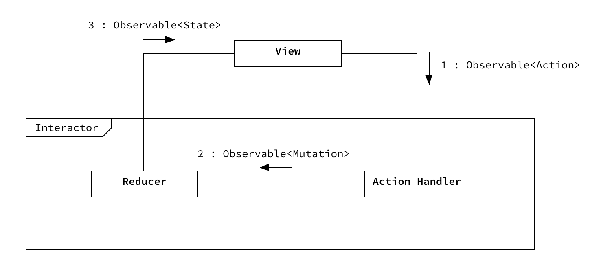

# Rx State Reducer

This repository demonstrates a pattern of asynchronous state management based on ideas of reactive programming, state reducer and unidirectional data flow. This is not a library, because you don’t need yet another library to implement this. 

## Running

1) Install [Carthage](https://github.com/Carthage/Carthage)
```
brew install carthage
```

2) Build the dependencies
```
carthage bootstrap --platform iOS
```

## Problem

**Asynchronous state management is a non-trivial modelling exercise and requires a reliable approach to keep it concise and maintainable.**

Most trivial applications start without any explicit state management approach. However, things quickly get out of hand when the number of states in which a system can reside starts to grow.

[Finite-State Machine](https://en.wikipedia.org/wiki/Finite-state_machine) and [State Pattern](https://en.wikipedia.org/wiki/State_pattern) can help manage synchronous state transitions, but are not designed to handle asynchronous behaviour.   

> Unless you can model your entire system synchronously, a single asynchronous source breaks imperative programming.
>
> -- Jake Wharton

## Solution

**Explicitly define the state of a system, then use a reducer function to compute a new state based on the previous state. Use reactive streams to handle asynchronous tasks and make data flow in one direction.**

1. An event is received and transformed to an `Action`.
2. The `Action` is handled and transformed to `Mutation`. _This transformation is needed when `Actions` require asynchronous handling. Such `Actions` produce multiple `Mutations` (e.g., (1) `loading`, (2) `loaded`)_
3. Each `Mutation` is passed to the `Reducer` function, which uses it to transform the current `State` to a new `State`.  

Where:

- `Action` - an interpretation of the system or user event  
- `Mutation` - a result of the `Action` handling  
- `State` - a model of the system or use case  
- `Reducer` - a pure function which takes a `State` and a `Mutation` and produces a new `State`



## Example

1. `View` receives a user event.
2. `View` transforms the event to an `Action`.
3. `View` propagates the `Action` to `Interactor`.
4. `Interactor` handles the `Action` and transforms it to `Mutations`.
5. `Interactor` uses each `Mutation` to transform the current `State` to a new `State`.
6. `Interactor` propagates the new `State` to `View`
7. `View` updates itself using the new `State`. The unidirectional feedback loop is now complete.

Given that `actions` is `Observable<Action>`, `states` is `Observable<State>`, the unidirectional feedback loop is expressed as:

```
states = actions.flatMap(handleAction).scan(State.initial, accumulator: reduce)
```

`Action` and `Mutation` are expressed as an `enum`:
```
enum Action {
    case reload
}

enum Mutation {
    case loading
    case records([Record])
    case failure(Error)
}
```

`State` is expressed as a `struct` (if there is a strict number of finite states, then `enum`):
```
struct State {
    var records: [Record]
    var isLoading: Bool
    var error: Error?

    static var initial = State(records: [], isLoading: false, error: nil)
}
```

`Reducer` is a pure function:
```
func reduce(state: State, mutation: Mutation) -> State {
    var state = state
    
    switch mutation {
    case let records(records):
        state.records = records
    case let failure(error):
        ...
    case loading:
        ...
    }
    return state
}
```

The function `handleAction` is asynchronous:
```
func handleAction(_ action: Action) -> Observable<Mutation> {
    switch action {
    case reload:
        return gateway.fetchRecords()
            .map(Mutation.records)
            .startWith(Mutation.loading)
            .catchError({ .just(Mutation.failure($0)) })
    }
}
```

## Further reading

* [Managing State with RxJava](https://www.youtube.com/watch?v=0IKHxjkgop4)
* [Reactive Apps with Model-View-Intent - Part3 - State Reducer](http://hannesdorfmann.com/android/mosby3-mvi-3)
